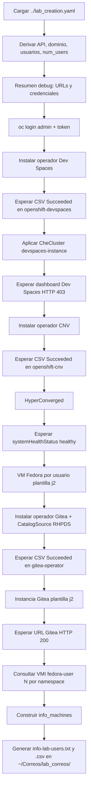
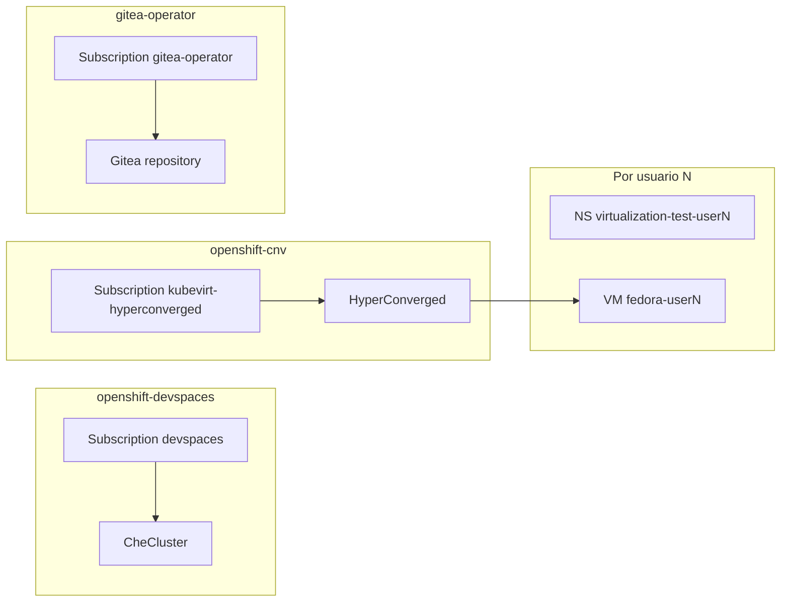

# lab-devspaces-ansible

Repositorio de Ansible para el **aprovisionamiento inicial del laboratorio OpenShift Dev Spaces** (y componentes asociados) sobre un clúster OpenShift ya provisionado (por ejemplo vía catálogo Babylon / `ResourceClaim`). El flujo principal está en `playbook-install-initial.yaml`.

> El comentario inicial del YAML del playbook menciona repositorio/webhook; el contenido actual del fichero es instalación de operadores e instancias en OpenShift.

## Objetivo

Instalar y dejar operativos, de forma automatizada:

- **Operador e instancia de Red Hat OpenShift Dev Spaces** (canal `stable`, namespace `openshift-devspaces`, CR `CheCluster`).
- **OpenShift Virtualization (CNV / KubeVirt)** y recurso **HyperConverged**.
- **Máquinas virtuales Fedora** por usuario de laboratorio (namespaces `virtualization-test-user{N}`, VM `fedora-user{N}`).
- **Operador Gitea** (catálogo RHPDS) e **instancia Gitea** con usuarios `lab-user-%d` y repositorios migrados desde GitHub (ejercicios del lab).
- **Ficheros de resumen** para participantes (`info-lab-users.txt` y `info-lab-users.csv`).

## Requisitos previos

- **OpenShift**: `oc` instalado y accesible desde el host donde se ejecuta Ansible.
- **Ansible** con la colección **`kubernetes.core`** (módulos `k8s`, `k8s_info`).
- **Fichero de estado del laboratorio**: el playbook carga `../lab_creation.yaml` (respecto a este directorio), es decir `lab_correos/lab_creation.yaml` en el árbol típico del workspace. Debe contener `status.summary.provision_data` con API, consola, contraseña de administrador, lista de usuarios, etc.
- **Ruta de salida**: las plantillas escriben en `~/Correos/lab_correos/`; crea esa ruta o ajusta las tareas `template` del playbook si usas otro directorio.

## Variables relevantes (desde `lab_creation.yaml`)

El playbook deriva:

| Concepto | Origen |
|----------|--------|
| API del clúster | `status.summary.provision_data.openshift_api_url` |
| Consola | `status.summary.provision_data.openshift_cluster_console_url` |
| Contraseña admin OpenShift | `status.summary.provision_data.openshift_cluster_admin_password` |
| Usuarios del lab | `status.summary.provision_data.users` |
| Dominio del clúster | Regex sobre la API: `api.<dominio>:6443` → `cluster_domain` |
| Número de usuarios | `users \| length` → `num_users` |

Variables fijas en el playbook:

| Variable | Valor | Uso |
|----------|-------|-----|
| `crc_user` | `admin` | `oc login` |
| `crc_validate_certs` | `false` | Llamadas a la API de Kubernetes |

Las plantillas `info-lab-users.*.j2` esperan que cada usuario esté indexado como `usuarios_finales["user1"]`, `usuarios_finales["user2"]`, … con campos como `user`, `password`, `login_command`, `openshift_console_url` (coherente con el formato generado por el aprovisionamiento del lab).

## URLs calculadas durante la ejecución

| Servicio | Patrón |
|----------|--------|
| Dev Spaces | `https://devspaces.apps.<cluster_domain>/dashboard/` |
| Gitea | `https://repository-gitea-operator.apps.<cluster_domain>` |

La espera sobre Dev Spaces comprueba **HTTP 403** en el dashboard (respuesta esperada sin sesión). Gitea se comprueba con **HTTP 200**.

## Ficheros del repositorio (resumen)

| Fichero | Uso |
|---------|-----|
| `playbook-install-initial.yaml` | Orquestación principal (`hosts: localhost`, `connection: local`). |
| `devspace-operator.yaml` | Namespace `openshift-devspaces`, OperatorGroup y Subscription `devspaces` (canal `stable`, `redhat-operators`). |
| `devspaces-instance.yaml` | CR `CheCluster` `devspaces` en `openshift-devspaces` (plantillas de namespace `<username>-devspaces`, límites de workspaces, etc.). |
| `openshift-virtualization.yaml` | Namespace `openshift-cnv` y Subscription `kubevirt-hyperconverged`. |
| `openshift-virtualization-hyper-converged.yaml` | CR `HyperConverged` en `openshift-cnv`. |
| `openshift-virtualization-machine-fedora.yaml.j2` | Por cada usuario: namespace, secreto SSH, `VirtualMachine` Fedora (`fedora-user{N}`). |
| `gitea.yaml` | Namespace `gitea-operator`, `CatalogSource` RHPDS, OperatorGroup y Subscription del operador Gitea. |
| `gitea-instance.yaml.j2` | CR `Gitea` con admin, usuarios `lab-user-%d`, contraseña de usuario y lista de repos migrados desde GitHub. |
| `info-lab-users.txt.j2`, `info-lab-users.csv.j2` | Salida consolidada (URLs, credenciales OpenShift/Dev Spaces/Gitea, línea por VM Fedora cuando hay datos en KubeVirt). |
| `ssh_tests_connections/` | Material de prueba SSH (referenciado en el contexto del lab; la plantilla VM incluye datos de clave en base64). |

## Flujo del playbook (`playbook-install-initial.yaml`)



## Arquitectura lógica en el clúster



## Ejecución

Desde el directorio de este repositorio, con `lab_creation.yaml` un nivel por encima:

```bash
cd /ruta/a/lab-devspaces-ansible
ansible-playbook playbook-install-initial.yaml
```

También es coherente ejecutarlo desde **Ansible Automation Platform / AWX** si el proyecto incluye este repo y el fichero `lab_creation.yaml` (o extra-vars equivalente) está disponible en la ruta esperada.

## Salidas generadas

En la máquina de control (`delegate_to: localhost`), según el playbook:

- `~/Correos/lab_correos/info-lab-users.txt`
- `~/Correos/lab_correos/info-lab-users.csv`

## Notas operativas

- Los bucles `until` con `retries` y `delay` dependen de la velocidad del clúster; en entornos lentos puede ser necesario aumentar reintentos.
- La instancia Gitea define administrador y usuarios de laboratorio en `gitea-instance.yaml.j2`; revisa contraseñas y repos migrados antes de un despliegue en producción.
- El nombre de algunos repositorios migrados en la CR puede no coincidir con el nombre del repo de origen en GitHub (revisa la lista `giteaRepositoriesList` en la plantilla).
