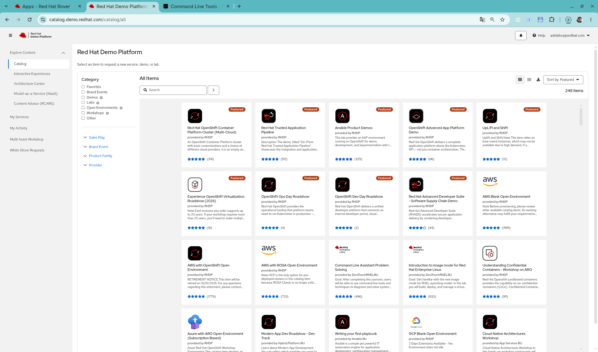
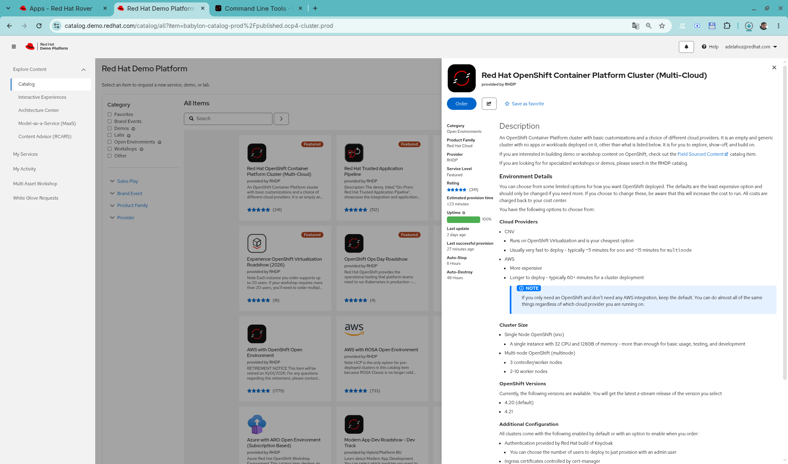
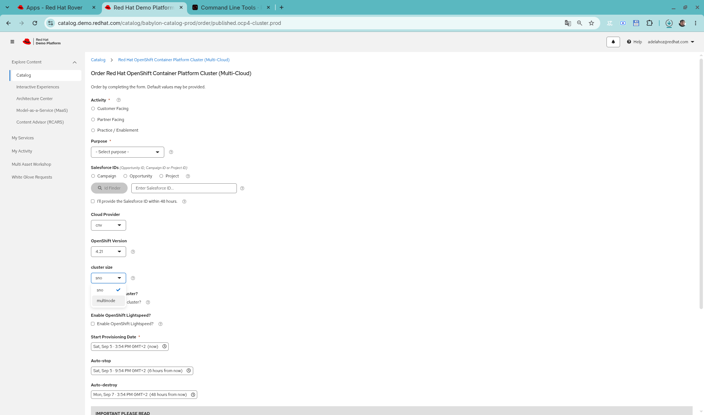
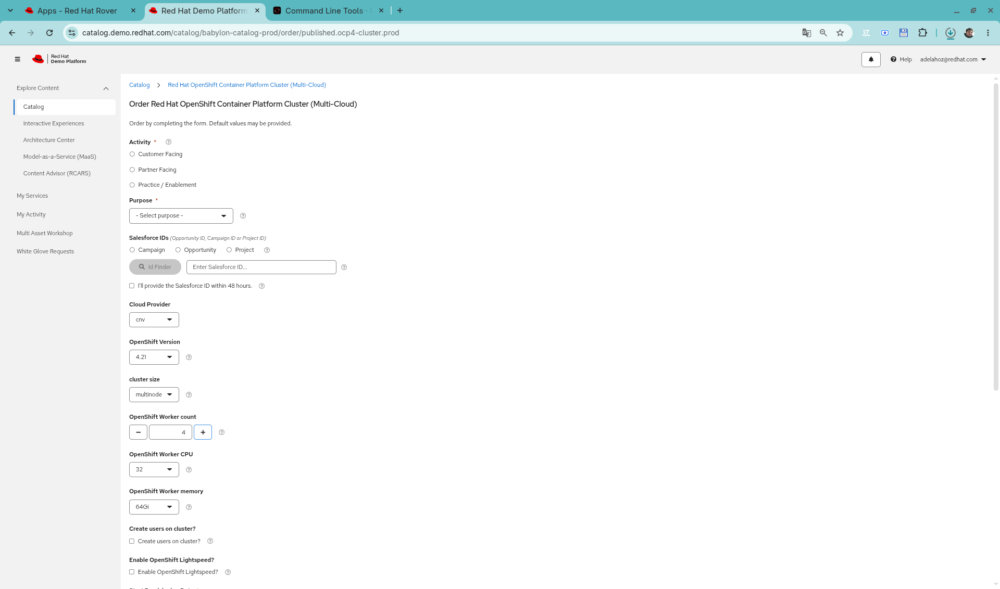
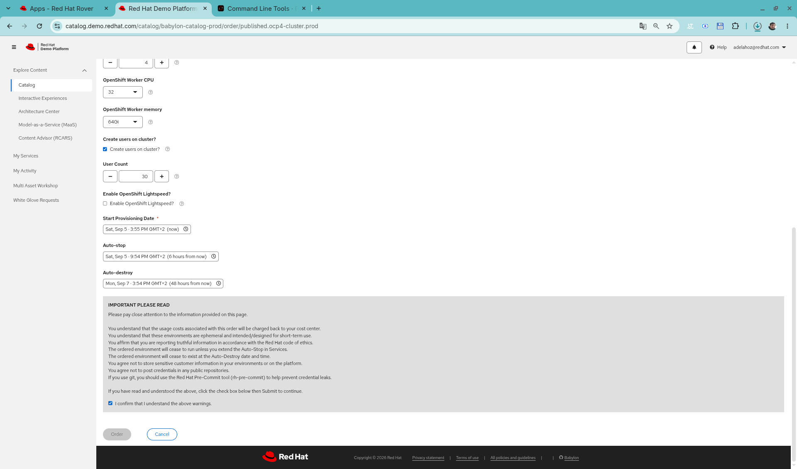
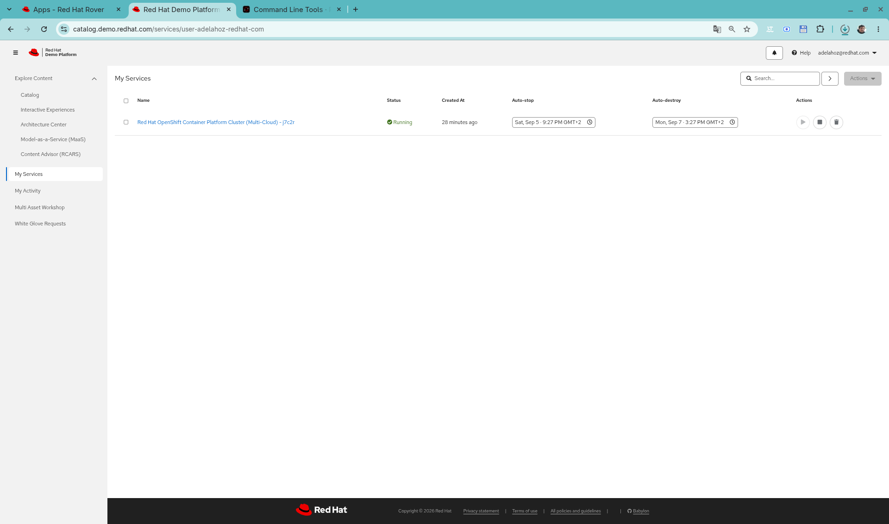
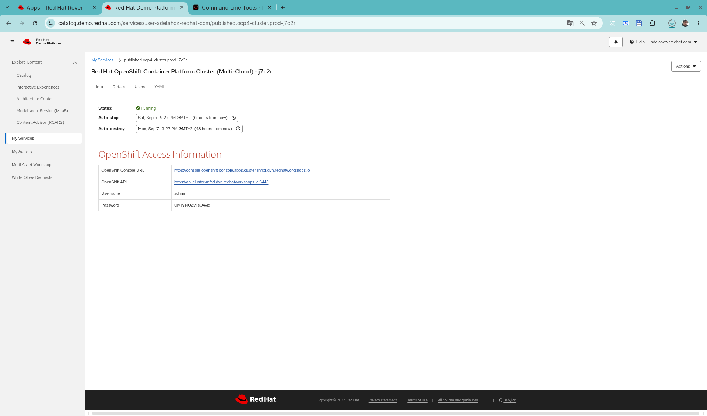
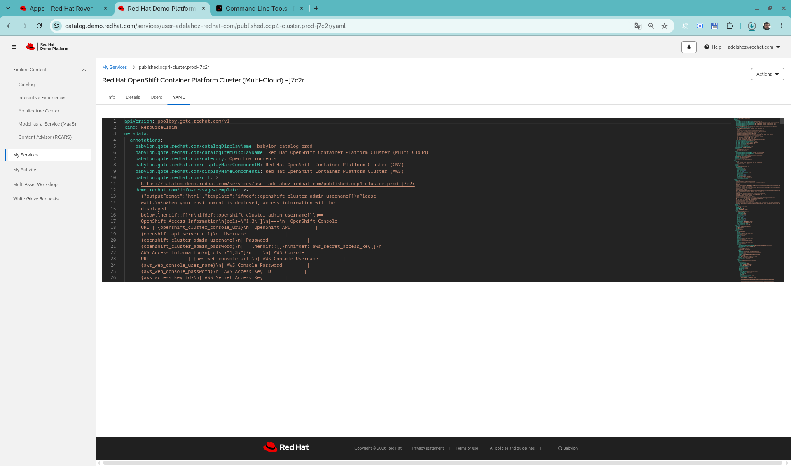
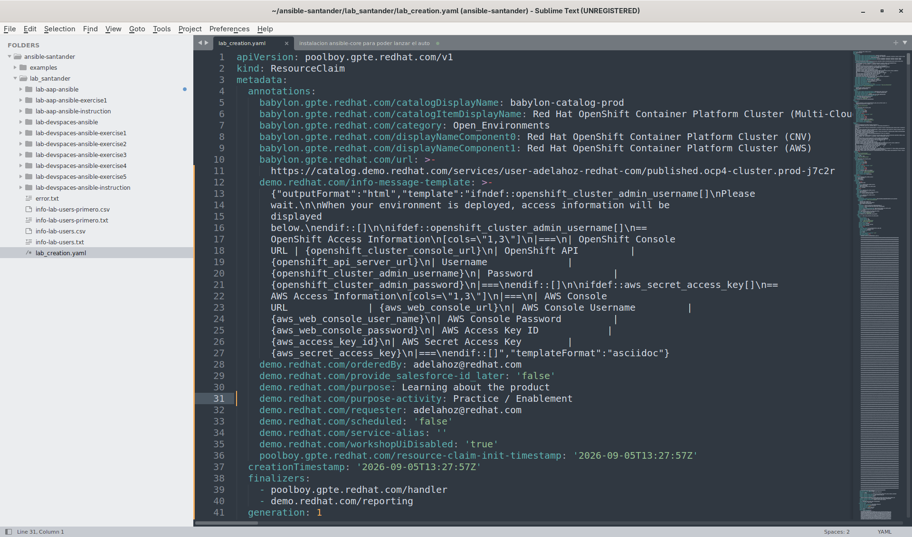
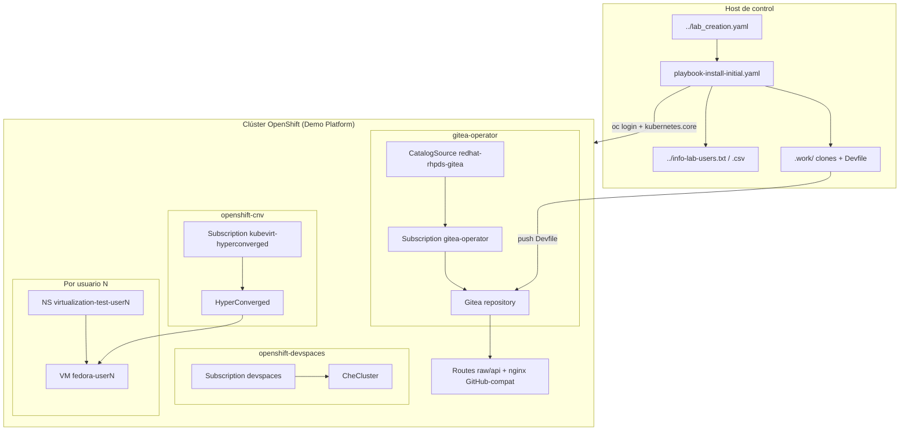

# lab-devspaces-ansible

Repositorio de Ansible para el **aprovisionamiento inicial del laboratorio OpenShift Dev Spaces** (y componentes asociados) sobre un clúster OpenShift ya provisionado en el ecosistema de **Red Hat Demo Platform**. El flujo principal está en `playbook-install-initial.yaml`.

Este repositorio **no crea el clúster**: instala operadores, instancias y contenido **dentro** de un OpenShift existente y genera ficheros de resumen en el host donde se ejecuta Ansible (`localhost`).

**English version:** [README_EN.md](README_EN.md)

## Objetivo

Instalar y dejar operativos, de forma automatizada:

- **Operador e instancia de Red Hat OpenShift Dev Spaces** (canal `stable`, namespace `openshift-devspaces`, CR `CheCluster`).
- **OpenShift Virtualization (CNV / KubeVirt)** y recurso **HyperConverged**.
- **Máquinas virtuales Fedora** por usuario de laboratorio (namespaces `virtualization-test-user{N}`, VM `fedora-user{N}`, `RoleBinding` admin hacia `user{N}`).
- **Operador Gitea** (catálogo RHPDS) e **instancia Gitea** con usuarios `lab-user-%d` y repositorios migrados desde GitHub (ejercicios e instrucciones del lab).
- **Shim GitHub-compat en Gitea** (sin tocar el operador ni el `CheCluster` de Dev Spaces): Dev Spaces trata Gitea como GitHub Enterprise y llama a `raw.<host>` / `api.<host>`, nombres que no cubre el comodín `*.apps`. El playbook emite un certificado público con cert-manager y publica Routes + un proxy nginx en `gitea-operator` que reescribe esas URLs a las de Gitea.
- **Devfile por usuario** en el repositorio de instrucciones de Gitea (`lab-devspaces-ansible-instruction`): espera a que exista el repo, lo clona, renderiza `devfiles/devfile.yaml.j2` y hace commit/push.
- **Ficheros de resumen** para participantes (`info-lab-users.txt` y `info-lab-users.csv`).

---

## 0. Requisitos previos del host de control

Antes de lanzar `playbook-install-initial.yaml` hay que preparar la máquina desde la que se genera el laboratorio (portátil, bastión o estación de trabajo).

### 0.1. Ansible Core

En el host de control debe estar instalado **ansible-core** (el playbook se ejecuta con `ansible-playbook` contra `localhost`).

En Fedora / RHEL / CentOS Stream:

```bash
sudo dnf install -y ansible-core git openssl
```

En otras distros, instala el paquete equivalente de `ansible-core` y comprueba:

```bash
ansible --version
ansible-playbook --version
```

Instala la colección usada por el playbook:

```bash
ansible-galaxy collection install kubernetes.core
```

También se usan módulos de `ansible.builtin` (`uri`, `git`, `template`, `command`, `file`, `assert`). En el PATH del host debe existir **`git`** (checkout y push de los repositorios de instrucciones).

### 0.2. Cliente `oc` de OpenShift

El playbook hace `oc login` y `oc whoami --show-token` para autenticarse contra la API. El binario **`oc`** debe estar instalado y en el `PATH`.

Puedes descargarlo desde la consola de cualquier clúster OpenShift: **(?) → Command Line Tools**, o directamente en `/command-line-tools`. Elige el paquete de tu sistema (Linux x86_64 / ARM64, macOS, Windows, RHEL 8 o RHEL 9).


Tras descomprimir, coloca `oc` en un directorio del `PATH` (por ejemplo `/usr/local/bin`) y verifica:

```bash
oc version --client
```

El cliente `oc` ofrece las mismas capacidades que `kubectl` y añade las extensiones de OpenShift. En esa misma página aparece **Copy login command** (login con token); el playbook, no obstante, inicia sesión con usuario `admin` y la contraseña del `ResourceClaim`.

---

## 1. Crear el clúster OpenShift en Red Hat Demo Platform

El laboratorio corre sobre un clúster OpenShift aprovisionado en [Red Hat Demo Platform](https://catalog.demo.redhat.com) (catálogo Babylon). El resultado es un `ResourceClaim` cuyo YAML se guarda como `lab_creation.yaml` un nivel por encima de este repositorio; el playbook lo carga con `vars_files: ../lab_creation.yaml`.

### 1.1. Abrir el catálogo

1. Entra en [https://catalog.demo.redhat.com/catalog/all](https://catalog.demo.redhat.com/catalog/all) con tu cuenta Red Hat.
2. En **Explore Content → Catalog**, busca el ítem **Red Hat OpenShift Container Platform Cluster (Multi-Cloud)** (categoría *Open Environments*).



### 1.2. Revisar la ficha y pulsar Order

En la ficha del ítem verás el tiempo estimado de provisión, proveedores de nube (CNV es la opción más rápida y económica; AWS es más lenta) y tamaños de clúster (*sno* / *multinode*). Pulsa **Order**.



### 1.3. Rellenar el pedido

Completa el formulario de pedido (`ocp4-cluster.prod`):

| Campo | Valor típico para este laboratorio |
|-------|-------------------------------------|
| Activity | *Practice / Enablement* (u otra que corresponda) |
| Purpose | El que aplique (p. ej. *Learning about the product*) |
| Salesforce IDs | El ID requerido, o marca el aplazamiento de 48 h si está permitido |
| Cloud Provider | `cnv` (recomendado) o `any` |
| OpenShift Version | La ofrecida en el catálogo (p. ej. `4.21`) |
| cluster size | `multinode` (recomendado: Dev Spaces + CNV + VMs + Gitea) o `sno` para pruebas mínimas |
| OpenShift Worker count / CPU / memory | Según el tamaño (p. ej. 4 workers, 32 CPU, 64Gi en *multinode*) |
| Create users on cluster? | **Activado**, con un **User Count** acorde al laboratorio |
| Enable OpenShift Lightspeed? | Desactivado salvo que lo necesites |
| Start / Auto-stop / Auto-destroy | Por defecto: provisión inmediata, auto-stop ~6 h, auto-destroy ~48 h. Amplía los plazos si el lab dura más. |

Pedido con tamaño *sno*:



Pedido *multinode* con workers y creación de usuarios:



Marca **Create users on cluster?**, indica el número de usuarios, lee el aviso de entornos efímeros, confirma las advertencias y pulsa **Order**.



### 1.4. Esperar a que el servicio esté Running

En **My Services** aparece el servicio (nombre tipo *Red Hat OpenShift Container Platform Cluster (Multi-Cloud) - …*). Espera a que el estado sea **Running**. Respeta auto-stop y auto-destroy, o ajústalos desde las acciones del servicio.



### 1.5. Anotar el acceso a OpenShift

En la pestaña **Info** del servicio están la consola, la API (`https://api.<cluster_domain>:6443`), el usuario `admin` y la contraseña. Esos valores son los que el playbook lee de `status.summary.provision_data`.



Desde esa misma consola puedes descargar `oc` (apartado 0.2) si aún no lo tienes.

### 1.6. Exportar el `ResourceClaim` como `lab_creation.yaml`

El playbook **no** se conecta a Demo Platform: espera un YAML local con el `ResourceClaim` (API `poolboy.gpte.redhat.com/v1`) **ya provisionado**, incluyendo `status.summary.provision_data` (API, consola, contraseña admin, mapa `users`, etc.).

1. En el servicio, abre la pestaña **YAML**.
2. Copia el manifiesto completo.
3. Guárdalo un nivel por encima de este repositorio, con el nombre `lab_creation.yaml`.

Estructura típica:

```text
lab_santander/
├── lab_creation.yaml          ← ResourceClaim exportado (vars_files del playbook)
├── lab-devspaces-ansible/     ← este repositorio
│   ├── playbook-install-initial.yaml
│   └── …
└── info-lab-users.txt         ← salida del playbook (se genera aquí)
```

Pestaña YAML del servicio:



Fichero local `lab_creation.yaml`:



Sin este fichero en `../lab_creation.yaml` respecto al playbook, Ansible no puede derivar API, dominio ni lista de usuarios.

---

## Variables relevantes (desde `lab_creation.yaml`)

El playbook deriva:

| Concepto | Origen |
|----------|--------|
| API del clúster | `status.summary.provision_data.openshift_api_url` |
| Consola | `status.summary.provision_data.openshift_cluster_console_url` |
| Contraseña admin OpenShift | `status.summary.provision_data.openshift_cluster_admin_password` |
| Usuarios del lab | `status.summary.provision_data.users` |
| Dominio del clúster | Regex sobre la API: `api.<dominio>:6443` → `cluster_domain` |
| Número de usuarios | `users \| length` → `num_users` |

Variables fijas en el playbook:

| Variable | Valor | Uso |
|----------|-------|-----|
| `crc_user` | `admin` | `oc login` |
| `crc_validate_certs` | `false` | Llamadas a la API de Kubernetes |
| `gitea_user_password` | `openshift` | API Gitea y clone/push de instrucciones |
| `instruction_repo` | `lab-devspaces-ansible-instruction` | Repo de instrucciones por usuario en Gitea |

Las plantillas `info-lab-users.*.j2` esperan usuarios indexados como `usuarios_finales["user1"]`, `usuarios_finales["user2"]`, … con campos `user`, `password`, `login_command`, `openshift_console_url`.

## URLs calculadas durante la ejecución

| Servicio | Patrón | Comprobación en el playbook |
|----------|--------|-----------------------------|
| Dev Spaces | `https://devspaces.apps.<cluster_domain>` | Dashboard `/dashboard/` → HTTP **403** (sin sesión) |
| Gitea | `https://repository-gitea-operator.apps.<cluster_domain>` | HTTP **200** |

Credenciales Gitea de laboratorio: administrador `opentlc-mgr` / `opentlc-mgr`; usuarios `lab-user-{N}` / `openshift`.

## Ficheros del repositorio (resumen)

| Fichero | Uso |
|---------|-----|
| `playbook-install-initial.yaml` | Orquestación principal (`hosts: localhost`, `connection: local`). |
| `devspace-operator.yaml` | Namespace `openshift-devspaces`, OperatorGroup y Subscription `devspaces` (canal `stable`, `redhat-operators`). |
| `devspaces-instance.yaml` | CR `CheCluster` `devspaces` en `openshift-devspaces`. |
| `openshift-virtualization.yaml` | Namespace `openshift-cnv` y Subscription `kubevirt-hyperconverged`. |
| `openshift-virtualization-hyper-converged.yaml` | CR `HyperConverged` en `openshift-cnv`. |
| `openshift-virtualization-machine-fedora.yaml.j2` | Por cada usuario: namespace, RoleBinding, secreto SSH, `VirtualMachine` Fedora (`fedora-user{N}`). |
| `gitea.yaml` | Namespace `gitea-operator`, `CatalogSource` RHPDS (`quay.io/rhpds/gitea-catalog`), OperatorGroup y Subscription. |
| `gitea-instance.yaml.j2` | CR `Gitea` con admin, usuarios `lab-user-%d` y repos migrados desde GitHub (ejercicios 1–5 + instrucciones). |
| `devfiles/devfile.yaml.j2` | Devfile 2.2.2 por usuario: proyectos Git apuntando a Gitea (`{{ gitea }}/lab-user-N/...`). |
| `devfiles/devfile.yaml` | Devfile estático de referencia. |
| `info-lab-users.txt.j2`, `info-lab-users.csv.j2` | Salida consolidada (URLs, credenciales OpenShift/Dev Spaces/Gitea, línea por VM). |
| `images/` | Capturas de requisitos previos (cliente `oc` y pedido del clúster en Demo Platform). |
| `.work/` | Directorio de trabajo generado (clones de instrucciones; no versionar). |

## Flujo del playbook (`playbook-install-initial.yaml`)


```mermaid
flowchart TD
  A[Cargar ../lab_creation.yaml] --> B[Derivar API, dominio, usuarios, num_users]
  B --> C[Resumen debug: URLs y credenciales]
  C --> D[oc login admin + token]
  D --> E[Instalar operador Dev Spaces]
  E --> F[Esperar CSV Succeeded en openshift-devspaces]
  F --> G[Aplicar CheCluster devspaces-instance]
  G --> H[Esperar dashboard Dev Spaces HTTP 403]
  H --> I[Instalar operador CNV]
  I --> J[Esperar CSV Succeeded en openshift-cnv]
  J --> K[HyperConverged]
  K --> L[Esperar systemHealthStatus healthy]
  L --> M[VM Fedora por usuario plantilla j2]
  M --> N[Instalar operador Gitea + CatalogSource RHPDS]
  N --> O[Esperar CSV Succeeded en gitea-operator]
  O --> P[Instancia Gitea plantilla j2]
  P --> Q[Esperar URL Gitea HTTP 200]
  Q --> R[Shim GitHub-compat en gitea-operator]
  R --> S[cert-manager cert raw/api + nginx + Routes]
  S --> V[Esperar repoMigrationComplete en CR Gitea]
  V --> W[Comprobar repo de instrucciones por usuario]
  W --> X[Clone + render Devfile + commit/push a Gitea]
  X --> Y[Consultar VMI fedora-user N]
  Y --> Z[Generar ../info-lab-users.txt y .csv]
```

## Arquitectura lógica en el clúster


```mermaid
flowchart TB
  subgraph Control["Host de control"]
    PB[playbook-install-initial.yaml]
    LC[../lab_creation.yaml]
    OUT[../info-lab-users.txt / .csv]
    WORK[".work/ clones + Devfile"]
    LC --> PB
    PB --> OUT
    PB --> WORK
  end

  subgraph OCP["Clúster OpenShift (Demo Platform)"]
    subgraph openshift-devspaces
      DS_OP[Subscription devspaces]
      DS_CR[CheCluster]
      DS_OP --> DS_CR
    end
    subgraph openshift-cnv
      CNV_OP[Subscription kubevirt-hyperconverged]
      HC[HyperConverged]
      CNV_OP --> HC
    end
    subgraph per_user["Por usuario N"]
      NS[NS virtualization-test-userN]
      VM[VM fedora-userN]
      NS --> VM
    end
    subgraph gitea-operator
      CS[CatalogSource redhat-rhpds-gitea]
      GIT_OP[Subscription gitea-operator]
      GIT_CR[Gitea repository]
      CS --> GIT_OP --> GIT_CR
    end
    HC --> VM
    RAW[Routes raw/api + nginx GitHub-compat]
    GIT_CR --> RAW
  end

  PB -->|oc login + kubernetes.core| OCP
  WORK -->|push Devfile| GIT_CR
```

**Lectura rápida**

| Ámbito | Dónde vive | Qué aporta este playbook |
|--------|------------|---------------------------|
| Dev Spaces | `openshift-devspaces` | Operador y `CheCluster` (sin cambios de CA ni SCM). |
| Virtualización | `openshift-cnv` + `virtualization-test-user{N}` | CNV + HyperConverged; una VM Fedora por usuario con RoleBinding a `user{N}`. |
| Gitea | `gitea-operator` | Operador RHPDS, instancia `repository`, usuarios `lab-user-%d`, migración de repos, Devfile por usuario y shim GitHub-compat (`raw.` / `api.`). |
| Salida | Directorio padre del playbook | `info-lab-users.txt` / `.csv`. |

## Ejecución

Desde el directorio de este repositorio, con `lab_creation.yaml` un nivel por encima y `oc` + `ansible-core` en el PATH:

```bash
cd /ruta/a/lab-devspaces-ansible
ansible-playbook playbook-install-initial.yaml
```

También es coherente ejecutarlo desde **Ansible Automation Platform / AWX** si el proyecto incluye este repo y `lab_creation.yaml` (o extra-vars equivalente) está en la ruta esperada.

## Salidas generadas

En el directorio padre del playbook (`delegate_to: localhost`):

- `../info-lab-users.txt`
- `../info-lab-users.csv`

Incluyen API, consola, Dev Spaces, Gitea, credenciales OpenShift por usuario y la línea de la VM Fedora cuando KubeVirt ya expone interfaces.

Durante la ejecución se crea además `lab-devspaces-ansible/.work/lab-devspaces-ansible-instruction-lab-user-{N}/` (clones locales; se puede borrar después).

## Notas operativas

- Los bucles `until` con `retries` y `delay` dependen de la velocidad del clúster; en entornos lentos puede ser necesario aumentar reintentos.
- El shim GitHub-compat de Gitea depende de cert-manager (el mismo ClusterIssuer que firma `*.apps`). Si ACME no emite `raw.<gitea>` / `api.<gitea>`, la factory de Dev Spaces seguirá fallando por SAN.
- El clone/push a Gitea desactiva la verificación TLS (`GIT_SSL_NO_VERIFY` / `http.sslVerify=false`) porque el certificado del laboratorio no está en el almacén del host de control.
- La instancia Gitea define administrador y usuarios en `gitea-instance.yaml.j2`; revisa contraseñas y la lista `giteaRepositoriesList` antes de un despliegue fuera del lab.
- El comentario inicial del YAML del playbook menciona webhook/repositorio; el contenido actual es instalación en OpenShift más preparación del Devfile de instrucciones.
