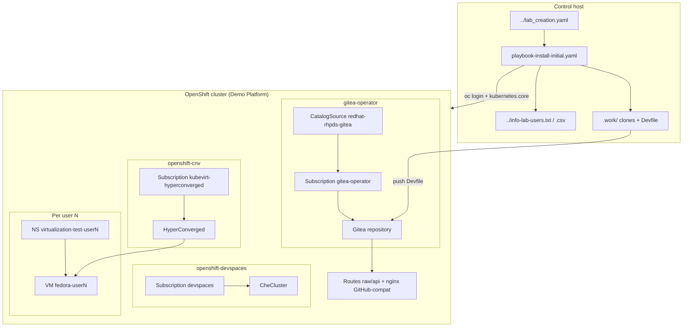

# lab-devspaces-ansible

Ansible repository for the **initial provisioning of the OpenShift Dev Spaces lab** (and associated components) on an OpenShift cluster already provisioned in the **Red Hat Demo Platform** ecosystem. The main flow is in `playbook-install-initial.yaml`.

This repository **does not create the cluster**: it installs operators, instances and content **inside** an existing OpenShift and generates summary files on the host where Ansible runs (`localhost`).

**Versión en castellano:** [README.md](README.md)

## Goal

Install and leave operational, in an automated way:

- **Red Hat OpenShift Dev Spaces operator and instance** (`stable` channel, namespace `openshift-devspaces`, CR `CheCluster`).
- **OpenShift Virtualization (CNV / KubeVirt)** and **HyperConverged** resource.
- **Fedora virtual machines** per lab user (namespaces `virtualization-test-user{N}`, VM `fedora-user{N}`, admin `RoleBinding` toward `user{N}`).
- **Gitea operator** (RHPDS catalog) and **Gitea instance** with `lab-user-%d` users and repositories migrated from GitHub (lab exercises and instructions).
- **GitHub-compat shim on Gitea** (without touching the operator or the Dev Spaces `CheCluster`): Dev Spaces treats Gitea as GitHub Enterprise and calls `raw.<host>` / `api.<host>`, names that the `*.apps` wildcard does not cover. The playbook issues a public certificate with cert-manager and publishes Routes plus an nginx proxy in `gitea-operator` that rewrites those URLs to Gitea’s.
- **Per-user Devfile** in the Gitea instruction repository (`lab-devspaces-ansible-instruction`): waits until the repo exists, clones it, renders `devfiles/devfile.yaml.j2` and commits/pushes.
- **Summary files** for participants (`info-lab-users.txt` and `info-lab-users.csv`).

---

## 0. Control host prerequisites

Before launching `playbook-install-initial.yaml` you must prepare the machine from which the lab is generated (laptop, bastion or workstation).

### 0.1. Ansible Core

**ansible-core** must be installed on the control host (the playbook runs with `ansible-playbook` against `localhost`).

On Fedora / RHEL / CentOS Stream:

```bash
sudo dnf install -y ansible-core git openssl
```

On other distros, install the equivalent `ansible-core` package and check:

```bash
ansible --version
ansible-playbook --version
```

Install the collection used by the playbook:

```bash
ansible-galaxy collection install kubernetes.core
```

Modules from `ansible.builtin` are also used (`uri`, `git`, `template`, `command`, `file`, `assert`). **`git`** must be on the host PATH (checkout and push of the instruction repositories).

### 0.2. OpenShift `oc` client

The playbook runs `oc login` and `oc whoami --show-token` to authenticate against the API. The **`oc`** binary must be installed and on the `PATH`.

You can download it from any OpenShift cluster console: **(?) → Command Line Tools**, or directly at `/command-line-tools`. Choose the package for your system (Linux x86_64 / ARM64, macOS, Windows, RHEL 8 or RHEL 9).


After unpacking, place `oc` in a directory on the `PATH` (for example `/usr/local/bin`) and verify:

```bash
oc version --client
```

The `oc` client offers the same capabilities as `kubectl` plus OpenShift extensions. That same page has **Copy login command** (token login); the playbook, however, signs in with user `admin` and the `ResourceClaim` password.

---

## 1. Create the OpenShift cluster on Red Hat Demo Platform

The lab runs on an OpenShift cluster provisioned on [Red Hat Demo Platform](https://catalog.demo.redhat.com) (Babylon catalog). The result is a `ResourceClaim` whose YAML is saved as `lab_creation.yaml` one level above this repository; the playbook loads it with `vars_files: ../lab_creation.yaml`.

### 1.1. Open the catalog

1. Go to [https://catalog.demo.redhat.com/catalog/all](https://catalog.demo.redhat.com/catalog/all) with your Red Hat account.
2. Under **Explore Content → Catalog**, search for the item **Red Hat OpenShift Container Platform Cluster (Multi-Cloud)** (*Open Environments* category).


### 1.2. Review the item and click Order

On the item page you will see the estimated provision time, cloud providers (CNV is the fastest and cheapest option; AWS is slower) and cluster sizes (*sno* / *multinode*). Click **Order**.


### 1.3. Fill in the order

Complete the order form (`ocp4-cluster.prod`):

| Field | Typical value for this lab |
|-------|----------------------------|
| Activity | *Practice / Enablement* (or another that applies) |
| Purpose | The one that applies (e.g. *Learning about the product*) |
| Salesforce IDs | The required ID, or mark the 48 h deferral if allowed |
| Cloud Provider | `cnv` (recommended) or `any` |
| OpenShift Version | The one offered in the catalog (e.g. `4.21`) |
| cluster size | `multinode` (recommended: Dev Spaces + CNV + VMs + Gitea) or `sno` for minimal tests |
| OpenShift Worker count / CPU / memory | According to size (e.g. 4 workers, 32 CPU, 64Gi on *multinode*) |
| Create users on cluster? | **Enabled**, with a **User Count** matching the lab |
| Enable OpenShift Lightspeed? | Disabled unless you need it |
| Start / Auto-stop / Auto-destroy | Defaults: immediate provision, auto-stop ~6 h, auto-destroy ~48 h. Extend the timeouts if the lab lasts longer. |

Order with *sno* size:


*Multinode* order with workers and user creation:


Check **Create users on cluster?**, set the number of users, read the ephemeral environments notice, confirm the warnings and click **Order**.


### 1.4. Wait until the service is Running

Under **My Services** the service appears (name like *Red Hat OpenShift Container Platform Cluster (Multi-Cloud) - …*). Wait until the status is **Running**. Respect auto-stop and auto-destroy, or adjust them from the service actions.


### 1.5. Note the OpenShift access

On the service **Info** tab you will find the console, the API (`https://api.<cluster_domain>:6443`), the `admin` user and the password. Those are the values the playbook reads from `status.summary.provision_data`.


From that same console you can download `oc` (section 0.2) if you do not have it yet.

### 1.6. Export the `ResourceClaim` as `lab_creation.yaml`

The playbook **does not** connect to Demo Platform: it expects a local YAML with the `ResourceClaim` (API `poolboy.gpte.redhat.com/v1`) **already provisioned**, including `status.summary.provision_data` (API, console, admin password, `users` map, etc.).

1. On the service, open the **YAML** tab.
2. Copy the full manifest.
3. Save it one level above this repository, named `lab_creation.yaml`.

Typical layout:

```text
lab_santander/
├── lab_creation.yaml          ← exported ResourceClaim (playbook vars_files)
├── lab-devspaces-ansible/     ← this repository
│   ├── playbook-install-initial.yaml
│   └── …
└── info-lab-users.txt         ← playbook output (generated here)
```

Service YAML tab:


Local `lab_creation.yaml` file:


Without this file at `../lab_creation.yaml` relative to the playbook, Ansible cannot derive the API, domain or user list.

---

## Relevant variables (from `lab_creation.yaml`)

The playbook derives:

| Concept | Source |
|---------|--------|
| Cluster API | `status.summary.provision_data.openshift_api_url` |
| Console | `status.summary.provision_data.openshift_cluster_console_url` |
| OpenShift admin password | `status.summary.provision_data.openshift_cluster_admin_password` |
| Lab users | `status.summary.provision_data.users` |
| Cluster domain | Regex on the API: `api.<domain>:6443` → `cluster_domain` |
| Number of users | `users \| length` → `num_users` |

Fixed variables in the playbook:

| Variable | Value | Use |
|----------|-------|-----|
| `crc_user` | `admin` | `oc login` |
| `crc_validate_certs` | `false` | Kubernetes API calls |
| `gitea_user_password` | `openshift` | Gitea API and instruction clone/push |
| `instruction_repo` | `lab-devspaces-ansible-instruction` | Per-user instruction repo on Gitea |

The `info-lab-users.*.j2` templates expect users indexed as `usuarios_finales["user1"]`, `usuarios_finales["user2"]`, … with fields `user`, `password`, `login_command`, `openshift_console_url`.

## URLs computed during execution

| Service | Pattern | Check in the playbook |
|---------|---------|------------------------|
| Dev Spaces | `https://devspaces.apps.<cluster_domain>` | Dashboard `/dashboard/` → HTTP **403** (no session) |
| Gitea | `https://repository-gitea-operator.apps.<cluster_domain>` | HTTP **200** |

Lab Gitea credentials: administrator `opentlc-mgr` / `opentlc-mgr`; users `lab-user-{N}` / `openshift`.

## Repository files (summary)

| File | Use |
|------|-----|
| `playbook-install-initial.yaml` | Main orchestration (`hosts: localhost`, `connection: local`). |
| `devspace-operator.yaml` | Namespace `openshift-devspaces`, OperatorGroup and Subscription `devspaces` (`stable` channel, `redhat-operators`). |
| `devspaces-instance.yaml` | CR `CheCluster` `devspaces` in `openshift-devspaces`. |
| `openshift-virtualization.yaml` | Namespace `openshift-cnv` and Subscription `kubevirt-hyperconverged`. |
| `openshift-virtualization-hyper-converged.yaml` | CR `HyperConverged` in `openshift-cnv`. |
| `openshift-virtualization-machine-fedora.yaml.j2` | Per user: namespace, RoleBinding, SSH secret, Fedora `VirtualMachine` (`fedora-user{N}`). |
| `gitea.yaml` | Namespace `gitea-operator`, RHPDS `CatalogSource` (`quay.io/rhpds/gitea-catalog`), OperatorGroup and Subscription. |
| `gitea-instance.yaml.j2` | CR `Gitea` with admin, `lab-user-%d` users and repos migrated from GitHub (exercises 1–5 + instructions). |
| `devfiles/devfile.yaml.j2` | Per-user Devfile 2.2.2: Git projects pointing at Gitea (`{{ gitea }}/lab-user-N/...`). |
| `devfiles/devfile.yaml` | Static reference Devfile. |
| `info-lab-users.txt.j2`, `info-lab-users.csv.j2` | Consolidated output (URLs, OpenShift/Dev Spaces/Gitea credentials, one line per VM). |
| `images/` | Prerequisite screenshots (`oc` client and cluster order on Demo Platform). |
| `.work/` | Generated working directory (instruction clones; do not version). |

## Playbook flow (`playbook-install-initial.yaml`)

```mermaid
flowchart TD
  A[Load ../lab_creation.yaml] --> B[Derive API, domain, users, num_users]
  B --> C[Debug summary: URLs and credentials]
  C --> D[oc login admin + token]
  D --> E[Install Dev Spaces operator]
  E --> F[Wait for CSV Succeeded in openshift-devspaces]
  F --> G[Apply CheCluster devspaces-instance]
  G --> H[Wait for Dev Spaces dashboard HTTP 403]
  H --> I[Install CNV operator]
  I --> J[Wait for CSV Succeeded in openshift-cnv]
  J --> K[HyperConverged]
  K --> L[Wait for systemHealthStatus healthy]
  L --> M[Fedora VM per user j2 template]
  M --> N[Install Gitea operator + RHPDS CatalogSource]
  N --> O[Wait for CSV Succeeded in gitea-operator]
  O --> P[Gitea instance j2 template]
  P --> Q[Wait for Gitea URL HTTP 200]
  Q --> R[GitHub-compat shim in gitea-operator]
  R --> S[cert-manager cert raw/api + nginx + Routes]
  S --> V[Wait for repoMigrationComplete on Gitea CR]
  V --> W[Check instruction repo per user]
  W --> X[Clone + render Devfile + commit/push to Gitea]
  X --> Y[Query VMI fedora-user N]
  Y --> Z[Generate ../info-lab-users.txt and .csv]
```



## Logical architecture on the cluster



**Quick read**

| Scope | Where it lives | What this playbook provides |
|-------|----------------|-----------------------------|
| Dev Spaces | `openshift-devspaces` | Operator and `CheCluster` (no CA or SCM changes). |
| Virtualization | `openshift-cnv` + `virtualization-test-user{N}` | CNV + HyperConverged; one Fedora VM per user with RoleBinding to `user{N}`. |
| Gitea | `gitea-operator` | RHPDS operator, `repository` instance, `lab-user-%d` users, repo migration, per-user Devfile and GitHub-compat shim (`raw.` / `api.`). |
| Output | Parent directory of the playbook | `info-lab-users.txt` / `.csv`. |

## Execution

From this repository directory, with `lab_creation.yaml` one level above and `oc` + `ansible-core` on the PATH:

```bash
cd /path/to/lab-devspaces-ansible
ansible-playbook playbook-install-initial.yaml
```

It is also consistent to run it from **Ansible Automation Platform / AWX** if the project includes this repo and `lab_creation.yaml` (or an equivalent extra-vars) is on the expected path.

## Generated outputs

In the parent directory of the playbook (`delegate_to: localhost`):

- `../info-lab-users.txt`
- `../info-lab-users.csv`

They include API, console, Dev Spaces, Gitea, OpenShift credentials per user and the Fedora VM line when KubeVirt already exposes interfaces.

During execution, `lab-devspaces-ansible/.work/lab-devspaces-ansible-instruction-lab-user-{N}/` is also created (local clones; can be deleted afterwards).

## Operational notes

- The `until` loops with `retries` and `delay` depend on cluster speed; on slow environments you may need to increase retries.
- The Gitea GitHub-compat shim depends on cert-manager (the same ClusterIssuer that signs `*.apps`). If ACME does not issue `raw.<gitea>` / `api.<gitea>`, the Dev Spaces factory will keep failing because of SAN.
- Clone/push to Gitea disables TLS verification (`GIT_SSL_NO_VERIFY` / `http.sslVerify=false`) because the lab certificate is not in the control host trust store.
- The Gitea instance defines administrator and users in `gitea-instance.yaml.j2`; review passwords and the `giteaRepositoriesList` before a deployment outside the lab.
- The initial comment in the playbook YAML mentions webhook/repository; the current content is OpenShift installation plus preparation of the instruction Devfile.
